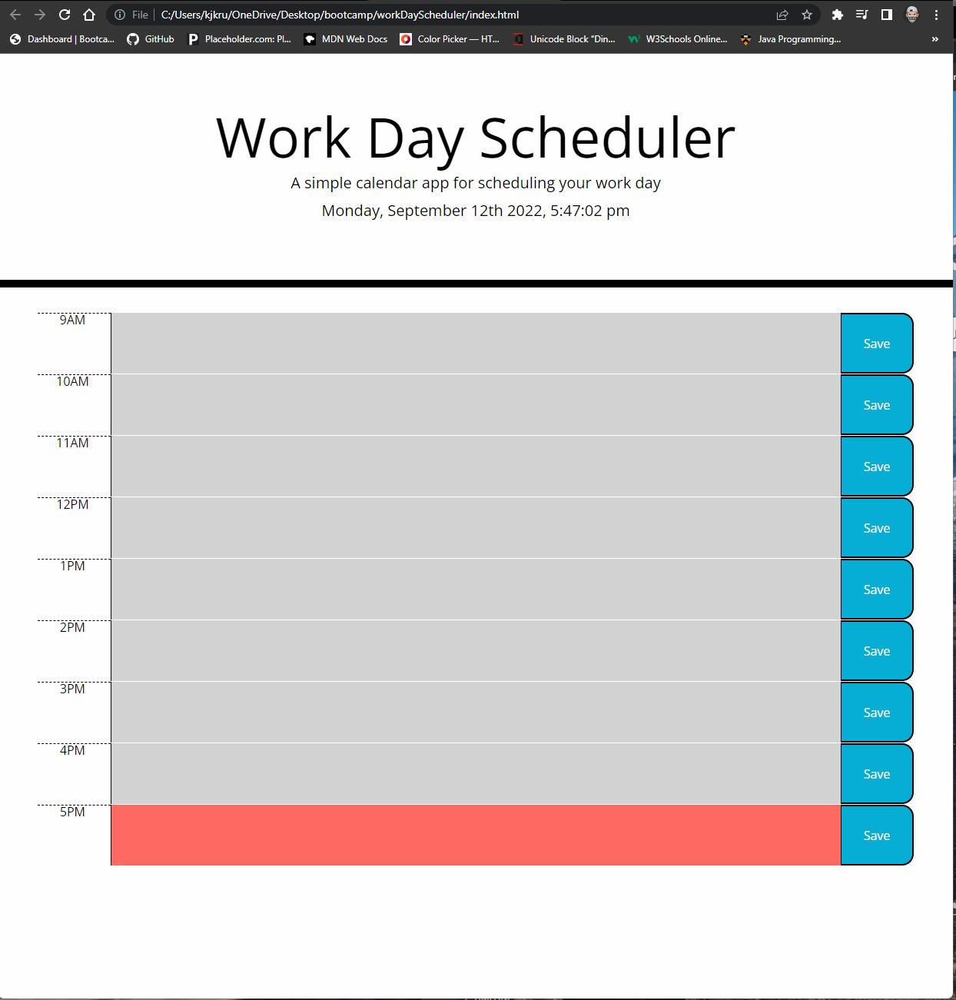

# workDayScheduler

Demo application

[app](https://kujo7721.github.io/workDayScheduler/)
  

  ## Description
  This application allows users to save daily activities by time slot. It used jQuery and moment.js and local storage

  

  ## Table of Contents (Optional)
  
  - [Installation](#installation)
  - [Usage](#usage)
  - [Contributing](#contributing)
  - [License](#license)
  - [Tests](#tests)
  - [Questions](#questions)

  ## Installation
  This project doesnt need installation

  
  
  
  ## Usage
  Open app in browser and follow interface

 
  
  ## Contributing
  To contribute please create a pull request
  
  
  
  ## License
  
    
    

  

  
  
  
  ## Questions
  [Link to Github page](https://github.com/KuJo7721)
  If you need any more information please email me @ kjkrueger12@gmail.com
  
  
  
  ## Tests
  No tests
  
  
